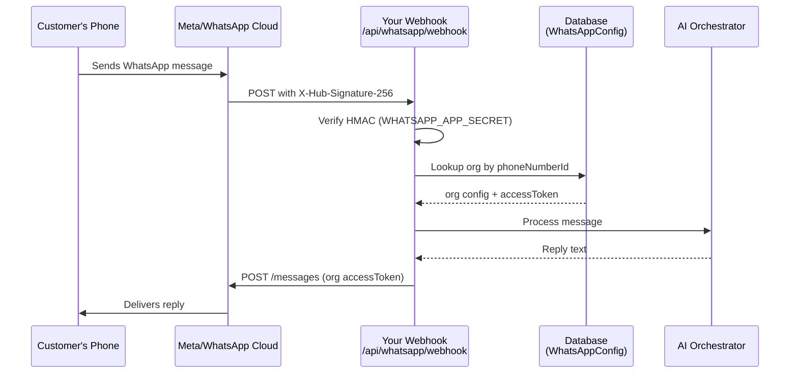

# WhatsApp Integration — Setup Guide & Bug Fix Summary

## What Was Fixed in the Codebase

| # | Location | Bug | Fix Applied |
|---|----------|-----|-------------|
| 1 | [`settings/page.tsx`](file:///Users/mac/Customer%20Assistance/apps/web/src/app/settings/page.tsx#L311) | `org?.whatsappConfigs?.[0]` — wrong casing, API returns `whatsAppConfigs` (capital A). Form never pre-populated. | Fixed to `org?.whatsAppConfigs?.[0]` |
| 2 | [`settings/page.tsx`](file:///Users/mac/Customer%20Assistance/apps/web/src/app/settings/page.tsx#L326) | Missing `webhookVerifyToken` in the POST payload — API rejected or saved blank token | Added `webhookVerifyToken` field + input |
| 3 | [`organizations.controller.ts`](file:///Users/mac/Customer%20Assistance/apps/api/src/organizations/organizations.controller.ts#L86) | Body field `businessAccountId` didn't match service's `whatsappBusinessId` — WABA ID was silently dropped every save | Fixed field name to `whatsappBusinessId` |
| 4 | [`whatsapp-sdk/src/index.ts`](file:///Users/mac/Customer%20Assistance/packages/whatsapp-sdk/src/index.ts#L11) | API version `v20.0` is outdated | Updated to `v22.0` |
| 5 | [`whatsapp.service.ts`](file:///Users/mac/Customer%20Assistance/apps/api/src/whatsapp/whatsapp.service.ts#L105) | Hardcoded `v20.0` in media URL strings | Updated to `v22.0` |
| 6 | [`.env`](file:///Users/mac/Customer%20Assistance/.env#L54) | Placeholder `WHATSAPP_APP_SECRET` + `WHATSAPP_VERIFY_TOKEN` → server refused to boot with real Meta traffic | Set real values |

---

## Your Credential Reference

| Credential | Value |
|-----------|-------|
| **Access Token** | `EAAWS63E8ei8B…` (provided) |
| **Phone Number ID** | `1319842031202307` |
| **WABA ID** | `1568175338085648` |
| **Phone Number** | +1 (555) 671-9884 |
| **Webhook Verify Token** | `kusu_wa_verify_2024_xK9mPqR7` (set in `.env`) |
| **App Secret** | Get from Meta Developer Portal (see Step 2 below) |

---

## Step-by-Step: Complete the Meta Side

> [!IMPORTANT]
> The code side is done. You must complete these steps in the Meta Developer Portal to make inbound messages work.

### Step 1 — Add Credentials in Settings UI

1. Start your dev server and navigate to **Settings → WhatsApp**
2. Fill in:
   - **Phone Number ID**: `1319842031202307`
   - **WhatsApp Business Account ID**: `1568175338085648`
   - **Display Phone Number**: `+1 555 671-9884`
   - **Permanent Access Token**: `EAAWS63E8ei8BSIGZCYVvziaZBX…` (your full token)
   - **Webhook Verify Token**: `kusu_wa_verify_2024_xK9mPqR7`
3. Click **Save WhatsApp Config**

### Step 2 — Get Your App Secret

1. Go to [Meta Developer Portal](https://developers.facebook.com/apps)
2. Select your app → **Settings → Basic**
3. Click **Show** next to **App Secret**
4. Copy and paste it into your `.env`:
   ```
   WHATSAPP_APP_SECRET=<your-app-secret-here>
   ```
5. Restart the API server

### Step 3 — Register the Webhook

1. In Meta Developer Portal → your app → **WhatsApp → Configuration**
2. Under **Webhook**, click **Edit**
3. Set **Callback URL**: `https://YOUR-DOMAIN/api/whatsapp/webhook`
4. Set **Verify token**: `kusu_wa_verify_2024_xK9mPqR7`
5. Click **Verify and save**

> [!TIP]
> For local development, use a tunneling tool like `ngrok` to expose your local API:
> ```bash
> ngrok http 4000
> ```
> Then use the ngrok HTTPS URL as your Callback URL.

### Step 4 — Subscribe to Webhook Fields

After verifying the webhook:
1. In **Webhook fields**, click **Manage**
2. Subscribe to: `messages`

### Step 5 — Test

Send a WhatsApp message from any phone to **+1 (555) 671-9884** and confirm you see activity in your server logs.

---

## How the Wiring Works



## Key Architecture Points

- **`WHATSAPP_APP_SECRET`** (in `.env`) → verifies every inbound webhook is genuinely from Meta
- **`WHATSAPP_VERIFY_TOKEN`** (in `.env`) → used once during webhook registration handshake
- **Access Token** (in DB per-org) → authenticates outbound messages to Meta's Graph API
- **Phone Number ID** (in DB per-org) → routes inbound webhooks to the correct organization
